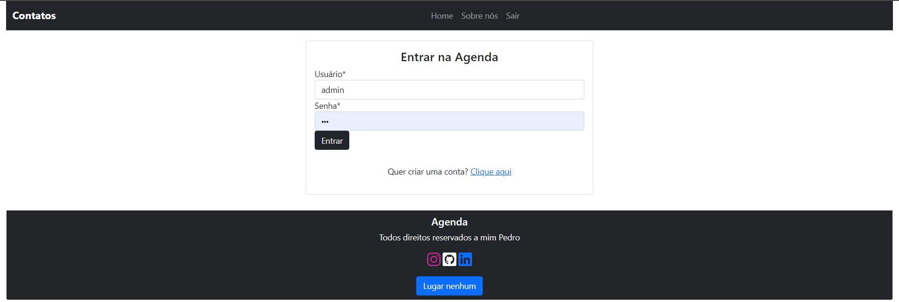
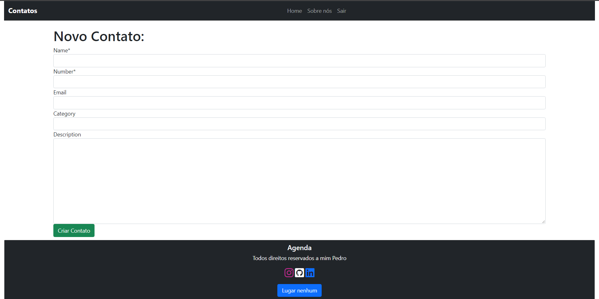
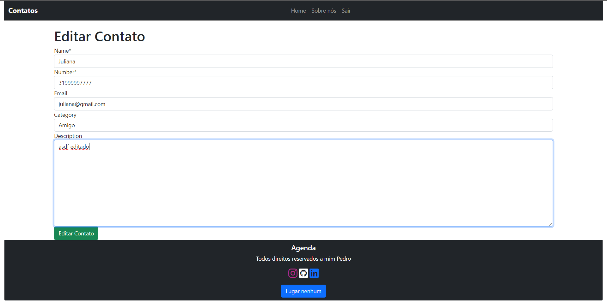
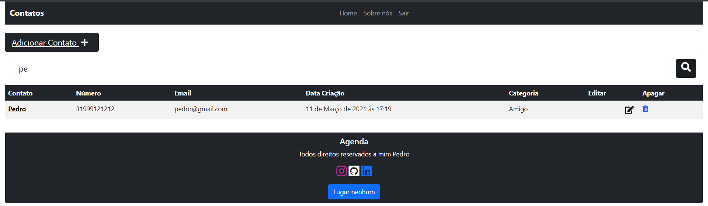
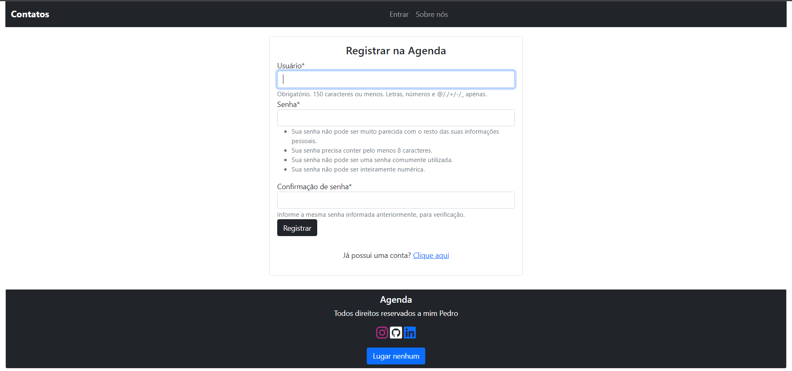

# Agenda
### Uma Agenda de contatos, onde pode adicionar, editar e apagar os contatos.
## Login

## Dashboard
``` Onde o Fica a pre visualização dos Contatos. ```

## Criação de um novo Contato.

## Edição do Contato

## Pesquisa
```  Onde o usuario digita uma palavra ou letra para a pesquisa. ```

## Cadastro do Usuario
``` Onde existe uma chave estrangeira, para cada novo usuário, com isso os blocos criados ficam alocados corretamente para o usuário ```
